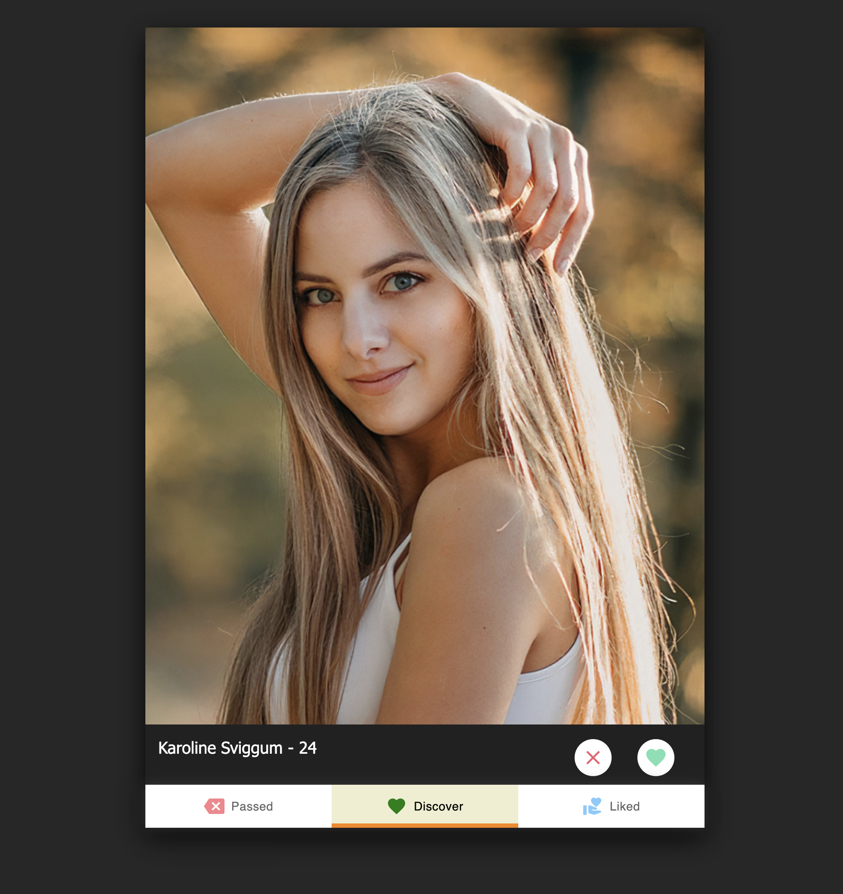
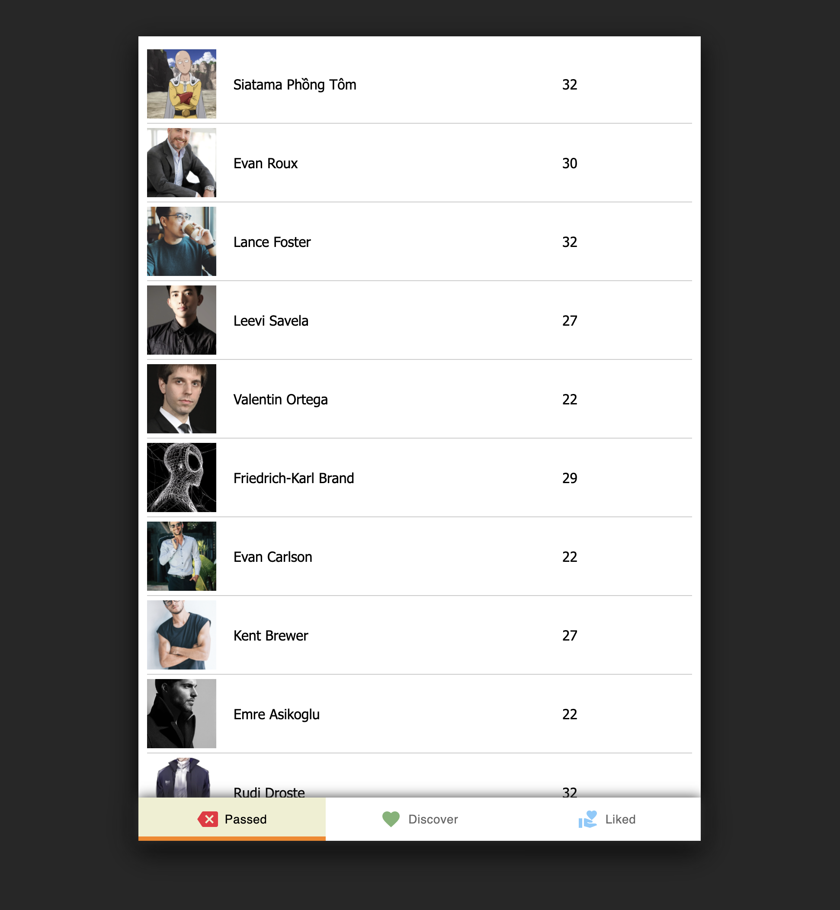

# Simple Tinder Web App - Fullstack

## Screenshots






## Implementation content

- Back-End:

  - Back-end JS framework: NodeJS
  - Database and API with Json Server, https://github.com/typicode/json-server
- Front-End:

  - SinglePage app with ReactJS
  - Use some UI libraries: MUI Material, Framer Motion, React Tinder Card

## How to run

- NPM install for both Front-End and Back-End
- BE host: http://localhost:3001
- FE host: http://localhost:3000
- If you get problems with XCode. Try this:

  ```
  sudo xcode-select --switch /Applications/Xcode.app/Contents/Developer
  ```

## Technical Debts

- Continuous and pagination Loadings
- Discover list resume issues after switching tabs/components
- Apply real DB

.

### More questions and concerns

Please reach out to me via this email address thetukiet@gmail.com
